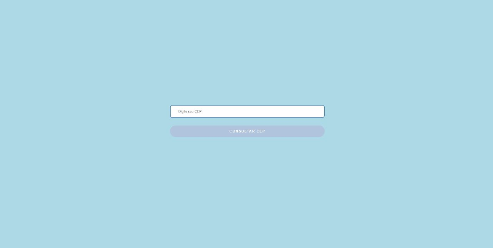
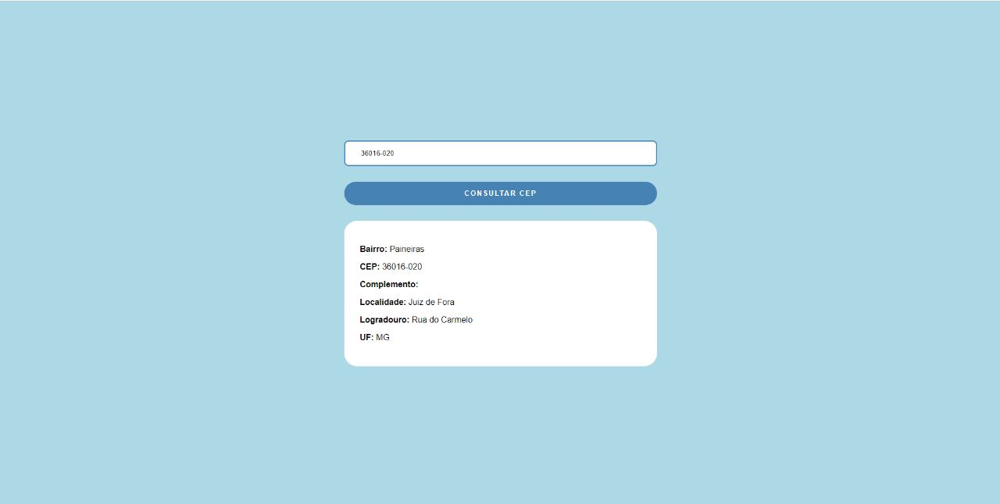
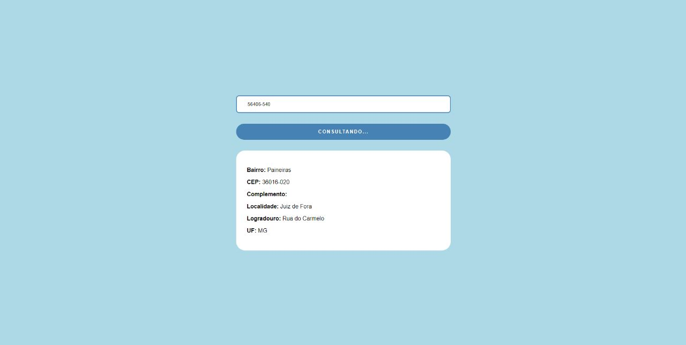
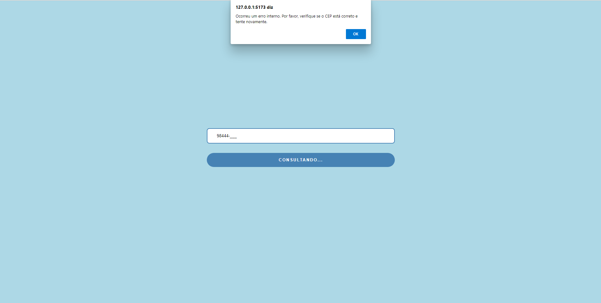
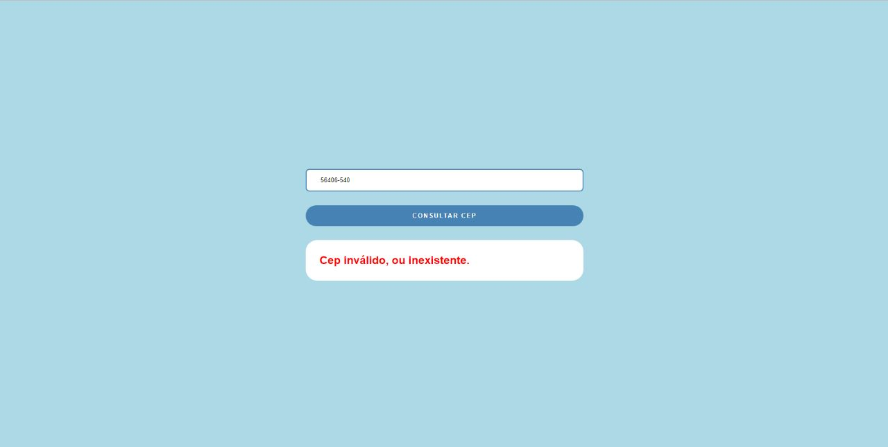

# Address Info Grabber

Com esse aplicativo eu tinha o desafio de realizar os seguintes desafios:

    1. Crie um componente em react (typescript) que irá consultar a api de frete: https://viacep.com.br, crie dois componentes um de input e outro de button.

    2. O Input de cep terá que ter uma máscara: xxxxx-xxx.

    3. Com o resultado da consulta renderize os dados do endereço abaixo do input de CEP. (pode ser dentro de outros inputs separados)

    4. Quando a consulta estiver sendo feita deve aparecer um loading indicando que a consulta está sendo realizada, para que o usuário possa aguardar.

    5. É necessário ter uma validação para possíveis erros na consulta, como por exemplo  um cep inválido ou erro 500 da API.

    6. Pode subir o código no github pessoal, ou nos enviar um arquivo zip com o código.

    7. Ter Readme, e explicar como você chamaria esse componente dentro de algum block.json e como seria a declaração desse componente dentro do interfaces.json no VTEXIO.

O passo **1.** é bem simples, podendo ser resolvido apenas com a componentização, e organização de pastas.

O passo **2.** eu acabei utilizando uma biblioteca do ReactJS chamada `react-input-mast`, que facilita a forma de inserir mascaras aos inputs.

Os passos **3.**, **4.** e **5.** são resolvido com a chamada da API, utilizando estados do ReactJS para salvar e renderizar as informações.

## Funcionamento do Projeto

**Na primeira página o Input e o Botão, sendo que caso não tenha nenhuma informação fornecida ao Input, o botão estará desabilitado**

**Ao obter sucesso, o componente renderiza as informações do endereço fornecido**

**O botão possui um layout de Loading para indicar ao usuário a consulta.**

**Caso o endereço não tenha sido completamente fornecido, ele dispara o erro acima em tela**

**Caso o endereço não exista, é renderizado uma informação que chama atenção do usuário informando que não foi possível pegar as informações.**

## Tecnologias e Bibliotecas Usadas

`ReactJS` `TypeScript` `Axios` `React-input-mask`

_E para o desenvolvimento do projeto foi utilizado o [Vite](https://vitejs.dev/)_

## Chamando o block no StoreFront

No StoreFront da sua loja, você irá chamar o nome do seu App Custom dentro do manifest.json.

O nome do app será o vendor + nome + versão descritos dentro do manifest.json do próprio app, e ficará dessa forma `"vendordoapp.meu-app-custom": "0.x"`.

Após isso é só declara-lo com o mesmo nome que colocamos no `interfaces.json`, no caso `"nome-do-componente"`

Como por exemplo:

`  "store.custom#custom": {
    "blocks": ["flex-layout.row#bloco-custom"]
  },
  "flex-layout.row#bloco-custom": {
    "children": ["nome-do-componente"]
  },`

**Muito importante lembrar de fazer o deploy do seu App, mais informações sobre o deploy [aqui.](https://developers.vtex.com/docs/guides/vtex-io-documentation-publishing-an-app)**

